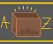
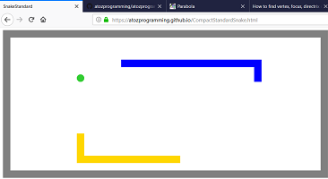
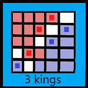

#  Welcome to A to Z programming

Your go-to javascript programming outlet
> This website is a long continuous project that is aiming on featuring extrodinary games that cannot be found elsewhere. This website has currently 2 games, and will be increasing its game count periodically. In addition to games, we feature side-projects for academic and entertainment purposes - feel free to check them out!

Quick links: 
  - **Top game:** [Snake Battle Royale](./CompactStandardSnake.html)
  - **Honorable game:** [3 kings](./3kingsBoardGame.html)
  - **Best simulation:** [Planental Orbit](./Physics2.html)
  - **Simmilar simulation:** [Random Planental Orbit](./Physics2rand.html)
  - **Honorable simulation:** [Earth Cannon](./Physics.html)

## Game List

Instructions are included for each game, along with the game link. Enjoy the great games!

#### [Snake Battle Royale](./CompactStandardSnake.html)

The most popular game, Snake Battle Royale pits you and 2 other players against each other as you all race for apples. It should also be kept in mind that a computer snake also competes.
  * ##### Scoring
The objective of the game is to score the most points by the time all the snakes die. Every apple you eat is worth one point, and there is a bonus 2-point reward for the player who survives the longest. Keep in mind that the snake that survives the longest may not win, as s/he may have not eaten enough apples to surpass the other players.
  * ##### Controls
       * _**Player1**_ (Blue) controls with the arrow keys

       * _**Player2**_ (Red) controls with the WASD keys

       * _**Player3**_ (Green) controls with the IJKL keys

       * _**Player4**_ (Yellow) is a computer, and thus has no keyboard controls.
  * ##### Skins
One of the best features this game has to offer is that you can enable skins for your characters. Each Snake(Blue, Red, and Green) has their own unique skin that is exclusive only to them, encouraging play with different snakes between game rounds. in order to activate your skin, you must note that before the game begins, there is a 3-ish second countdown. If you press any of your control keys (other than your right key, be it the right arrow, "d", or "l") before the game begins, you can toggle your skin. The skins are different for each player, and do not alter gameplay.

To restart the game, simply refresh the page.

#### [3 kings](./3kingsBoardGame.html)

Although Snake Battle Royale was released first on the website, this game was the first game on the entire website that was programmed. The instructions are provided in-game. 3 kings is a board game that plays the computer against you in a strategy game, with only 3 pieces per side, making piece sacrifices game-turning events. Can you stand your ground as the computer closes in on your home base?
  * ##### Tips
    * Pressing "0" at the start menu will have your turn be second
    * Pressing "T" will toggle the territory-viewing mode, which helps aid player strategies, showing the squared controlled by the player, the squares controlled by the computer, and contested squares.

#### [Snake Unlimited](./SnakeUnlimited.html)

For those who are bad at Snake Battle Royale and constantly die, this is the solution. Whenever a player dies, the are randomly teleported to the edge of the board, and continue playing normally. The board no longer shrinks, in order to produce large snakes that dominate the board. This timeless game does not end, but can still become competitive!
  * ##### Rules and Controls
    * See the rules for regular Snake Battle Royale.
  * ##### Changes
    * Players constantly respawn
    * The board does not shrink
    * Players that run into another snake increase the winning snake's length and score (though length boost is not as large as score boost)
#### More Games coming soon!

Always check back for updates!

## Related Projects

Each side-project will have description text on the page.

#### [Earth Cannon](./Physics.html)
Topics covered include, but are not limited to:
  - Circle Radians
  - Velocity
  - Force and Acceleration
  - Earth's Gravitational Constant

The Earth Cannon demonstrates bouncing ball physics on the Earth.
#### [Planental Orbit](./Physics2.html)
Topics covered include, but are not limited to:
  - Velocity
  - Distribution of the total force on the x and y planet velocities
  - Force and Acceleration
  - Newton's Second Law
  
The Planental Orbit demonstrates the orbits of the planet in relation to the Sun.
#### [Random Planental Orbit](./Physics2rand.html)
This simulation covers the same topics as the [Planental Orbit](./Physics2.html) simulation, it just has random velocities for the planets.

## Update Log

Ever wonder when a game or simulation was released? The Update Log is always available for quick reference.
  - **5/22/2019:** 3 Kings game released, uploaded screenshots of games
  - **5/20/2019:** Planental Orbit(s) and Earth Cannon simulations released
  - **5/19/2019:** Snake Battle Royale released
  - **5/18/2019:** Website created
