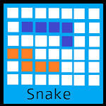

#  Welcome to A to Z programming

Your go-to javascript programming outlet
>This website will be a sandbox for programming projects. Tools, games, educational materials, all will be available on this website. Spread the link to friends and family!

Testing

### **Games + Tools**

Click on any icon to access its contents. Tools are Green, and Games are Blue.

## Related Projects

Each side-project will have description text on the page.

#### [Earth Cannon](./Physics.html)
Topics covered include, but are not limited to:
  - Circle Radians
  - Velocity
  - Force and Acceleration
  - Earth's Gravitational Constant

The Earth Cannon demonstrates bouncing ball physics on the Earth.
#### [Planental Orbit](./Physics2.html)
Topics covered include, but are not limited to:
  - Velocity
  - Distribution of the total force on the x and y planet velocities
  - Force and Acceleration
  - Newton's Second Law
  
The Planental Orbit demonstrates the orbits of the planet in relation to the Sun.
#### [Random Planental Orbit](./Physics2rand.html)
This simulation covers the same topics as the [Planental Orbit](./Physics2.html) simulation, it just has random velocities for the planets.

## Update Log

Ever wonder when a game or simulation was released? The Update Log is always available for quick reference.
  - **6/14/2019:** A fresh break from snake, the Calculator is released
  - **6/2/2019:** Mass transfer glitch patched in Snake Unlimited
  - **6/1/2019:** 1-player Snake Battle Royale released
  - **5/28/2019:** 1-player Snake Unlimited released
  - **5/25/2019:** Snake Unlimited released
  - **5/22/2019:** 3 Kings game released, began uploading screenshots of games
  - **5/20/2019:** Planental Orbit(s) and Earth Cannon simulations released
  - **5/19/2019:** Snake Battle Royale released
  - **5/18/2019:** Website created
